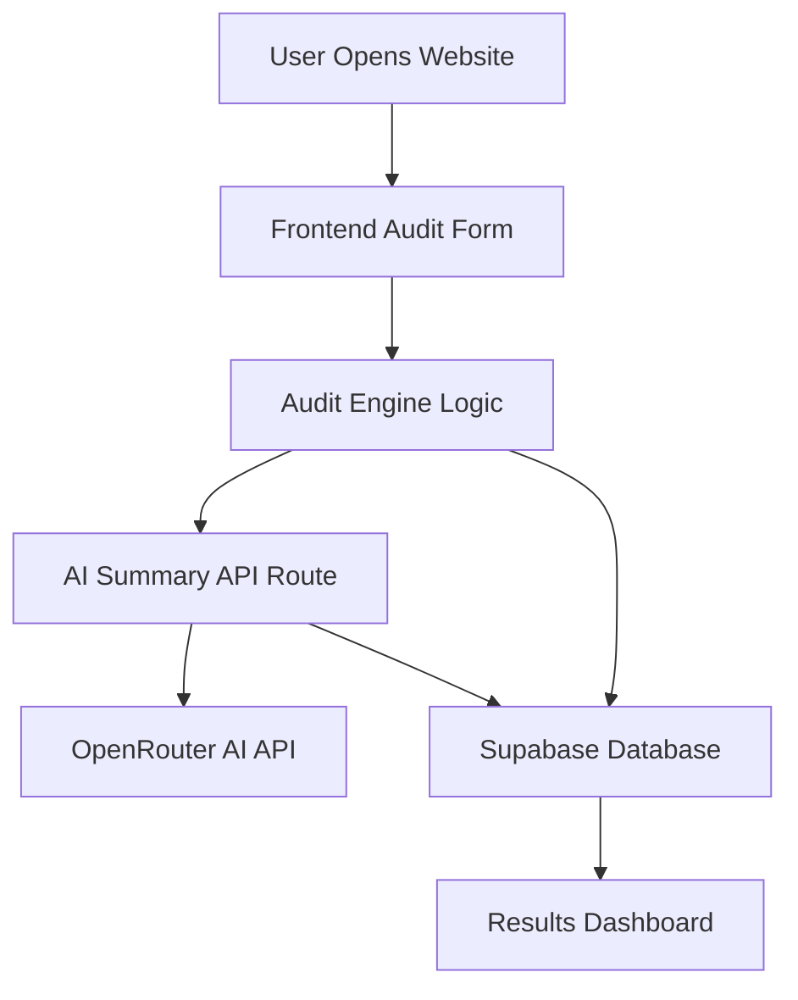

# ARCHITECTURE.md

# AI Spend Audit Platform — System Architecture

This document explains the architecture, data flow, technology decisions, and scalability considerations for the AI Spend Audit Platform.

---

# High-Level Overview

The platform is designed to help startups and small businesses analyze AI software spending, calculate optimization opportunities, and generate AI-powered audit summaries.

The system uses a lightweight full-stack architecture built with Next.js, Supabase, and AI APIs.

---

# System Architecture Diagram



---

# Core Components

## 1. Frontend Layer

### Technology
- Next.js
- React
- Tailwind CSS

### Responsibilities
- Collect user audit inputs
- Display audit calculations
- Show optimization recommendations
- Render AI-generated summaries
- Handle loading and error states
- Navigate between pages

### Why Next.js?

Next.js was selected because it provides:

- Built-in routing
- API routes
- Excellent deployment support on Vercel
- Server-side capabilities
- Optimized production builds
- Better Lighthouse performance

Using Next.js simplified the full-stack architecture and reduced backend setup complexity.

---

# 2. Audit Engine

The audit engine performs all pricing and savings calculations.

### Responsibilities

- Analyze AI software subscriptions
- Compare current pricing vs optimized pricing
- Calculate:
  - Current spend
  - Optimized spend
  - Total savings
  - Annual savings
  - Credex savings
- Generate structured audit results

### Logic Flow

```txt
User Inputs
   ↓
Validation
   ↓
Pricing Lookup
   ↓
Optimization Rules
   ↓
Savings Calculation
   ↓
Audit Result Generation
```

---

# 3. AI Summary Service

The AI summary layer generates a professional business summary based on the audit results.

### API Route

```txt
/app/api/generate-summary/route.js
```

### Responsibilities

- Accept audit data
- Generate structured prompts
- Send prompts to OpenRouter
- Receive AI-generated summary
- Return formatted business insights

### AI Workflow

```txt
Audit Results
    ↓
Prompt Construction
    ↓
OpenRouter API
    ↓
DeepSeek Model
    ↓
Business Summary
```

---

# 4. Database Layer

### Technology
- Supabase

### Responsibilities

- Store audit reports
- Store AI summaries
- Save spending calculations
- Persist generated report IDs
- Support future analytics features

### Main Table

```txt
audits
```

### Stored Data

- Audit ID
- Lead ID
- Team size
- Use case
- Raw audit data
- Calculated savings
- AI summary
- Annual savings

---

# Data Flow

## Step-by-Step User Journey

### Step 1 — User Input

The user fills the audit form with:
- AI tools used
- Team size
- Current subscriptions
- Usage information

---

### Step 2 — Audit Processing

The frontend processes the form data and sends it to the audit engine.

The engine:
- Matches tools with pricing data
- Applies optimization rules
- Calculates savings opportunities

---

### Step 3 — AI Summary Generation

The processed audit results are sent to:

```txt
/api/generate-summary
```

The API route:
- Builds a structured AI prompt
- Sends data to OpenRouter
- Receives a professional summary

---

### Step 4 — Data Storage

Audit results and summaries are stored in Supabase.

---

### Step 5 — Results Dashboard

The user is redirected to a dedicated results page displaying:
- Spend analysis
- Savings estimates
- Optimization recommendations
- AI-generated insights

---

# Why JavaScript Instead of TypeScript?

TypeScript is strongly preferred for large-scale production systems. However, JavaScript was selected for this assignment because:

- Faster iteration speed
- Reduced setup complexity
- Short development timeline
- Rapid prototyping focus

The project structure is intentionally modular so TypeScript migration can be completed later with minimal architectural changes.

---

# Why Tailwind CSS?

Tailwind CSS was selected because it provides:

- Faster UI development
- Small production CSS bundles
- Better responsive control
- Utility-first styling consistency
- Excellent integration with Next.js

This improved development speed while maintaining high Lighthouse scores.

---

# API Design

## Generate Summary Endpoint

```txt
POST /api/generate-summary
```

### Request Body

```json
{
  "auditResults": [],
  "totalSavings": 5000,
  "currentSpend": 15000,
  "optimizedSpend": 10000
}
```

### Response

```json
{
  "success": true,
  "summary": "AI-generated optimization summary..."
}
```

---

# Security Considerations

## Environment Variables

Sensitive credentials are stored using environment variables:

```env
OPENROUTER_API_KEY=
NEXT_PUBLIC_SUPABASE_URL=
NEXT_PUBLIC_SUPABASE_ANON_KEY=
```

No secrets are committed to the repository.

---

# Error Handling

The platform includes:
- AI API fallback responses
- Loading states
- Try/catch handling
- Supabase error handling
- Network request validation

---

# Performance Considerations

The application is optimized for:
- Fast page loads
- Minimal client-side JavaScript
- Responsive layouts
- Efficient API usage

Performance targets:
- Lighthouse Performance ≥ 85
- Accessibility ≥ 90
- Best Practices ≥ 90

---

# Scalability Considerations

If the system needed to support 10,000+ audits per day, the following architectural improvements would be implemented:

## 1. Move Audit Engine to Dedicated Backend Services

Instead of running calculations inside frontend-heavy flows:
- Use microservices
- Separate compute workloads
- Introduce queue-based processing

---

## 2. Add Background Job Queues

AI summary generation would move to:
- Redis queues
- Background workers
- Async processing pipelines

This prevents API bottlenecks during traffic spikes.

---

## 3. Database Optimization

Improvements:
- Database indexing
- Read replicas
- Partitioned tables
- Query caching

---

## 4. AI Request Optimization

To reduce AI costs:
- Prompt caching
- Template-based summaries
- Batch AI requests
- Fine-tuned lightweight models

---

## 5. Monitoring & Observability

Production-scale deployment would require:
- Error tracking
- Logging systems
- Performance monitoring
- Rate limiting
- Usage analytics

Tools could include:
- Sentry
- PostHog
- Grafana
- Cloudflare Analytics

---

# Future Architecture Improvements

Planned improvements include:
- User authentication
- Multi-tenant support
- Exportable PDF reports
- Admin analytics dashboard
- Historical trend analysis
- Real-time benchmarking
- AI recommendation engine

---

# Conclusion

The current architecture prioritizes:
- Rapid development
- Simplicity
- Maintainability
- Scalability readiness
- Strong frontend performance

The stack provides a strong balance between developer productivity and production capability while remaining lightweight enough for fast iteration and deployment.